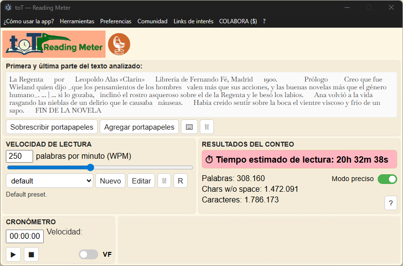
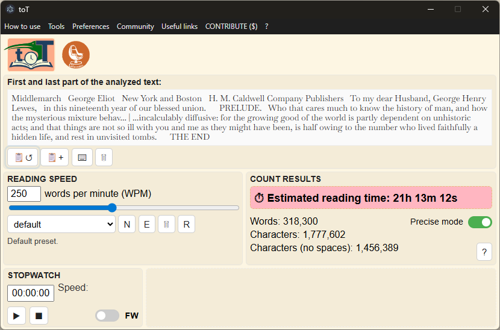

* [Español](#es)
* [English](#en)

---

<a id="es"></a>

# toT — de Texto a Tiempo

**toT** es una app de escritorio que convierte texto en tiempo estimado de lectura y te ayuda a planificar cargas de lectura realistas. Combina presets de WPM configurables, conteo preciso, snapshots del texto actual, editor de tareas y cronómetro para que puedas medir, organizar y terminar lecturas con menos incertidumbre.

*¿No te atreves a empezar ciertas lecturas debido a no saber cuánto trabajo realmente te tomará?*
*¿Te cuesta terminar las lecturas y las abandonas en la mitad?*
*¿Quieres superar tus dificultades y desarrollar tu capacidad de lectura apoyándote en herramientas de medición y organización científicas?*
*¿Tu navegador acumula un montón de pestañas y marcadores con noticias y artículos de interés, que no sabes si vas a poder leer?*
*¿Tienes que dar una clase este semestre y debes entregar a tus estudiantes una bibliografía realista?*
*¿Debes preparar para mañana un escrito para exponer ante un auditorio durante una hora?*
*¿Necesitas hacer un guión para una cápsula audiovisual con un tiempo preciso?*
*¿La ruma de libros en tu velador crece sin compasión?*
*¿Quieres hacer estudios experimentales relacionados con el tiempo de lectura?*

## Funcionalidades

* El texto se puede introducir pegándolo desde el portapapeles y/o manualmente.
* Editor de texto completo con búsqueda.
* Estimación de tiempo de lectura con WPM (palabras por minuto) configurable.
* Conteo de palabras y caracteres (con/sin espacios).
* Segmentación “precisa” de palabras usando `Intl.Segmenter`.
* Presets de WPM: crear/editar/eliminar + restaurar valores por defecto.
* Cronómetro con cálculo de WPM real + ventana flotante.
* Snapshots de textos: guardar/cargar los textos actuales.
* Editor de tareas: organizador de listas de textos para planificar lecturas.
* Interfaz multi-idioma: `es`, `es-cl`, `arn`, `en`, `fr`, `de`, `it`, `pt`.

---

## Requisitos

### Usuarios finales
* **Windows (build portable)**: Windows 10/11 (64-bit).
* **Planificado**: macOS y Linux (aún no soportado oficialmente).

### Desarrolladores (ejecutar desde el código fuente)
* Node.js 18+ (recomendado: LTS actual)
* npm (incluido con Node.js)

---

## Instalación / Cómo ejecutar

1. Ir a [GitHub Releases](https://github.com/Cibersino/tot/releases) y descargar el último **`.zip` portable para Windows**.
2. Extraer el `.zip` en cualquier carpeta.
3. Ejecutar el `.exe` dentro de la carpeta extraída.

Notas:
* Este es un **build portable** (sin instalador).
* El estado/configuración se almacena localmente en `app.getPath('userData')/config` (sin dependencia de servicios en la nube).

---

## Uso

Las instrucciones de uso están incluidas en el menú de la app (“¿Cómo usar la app?”).

Accesos rápidos visibles en la ventana principal:
* `📋↺` / `📋+`: reemplazar o agregar texto desde portapapeles.
* `⌨`: abrir editor de texto completo.
* `💾` / `📂`: guardar/cargar snapshot del texto actual.
* `📝` / `🗃️`: nueva tarea o cargar tarea.

---

## Capturas de pantalla



---

## Ejecutar desde el código fuente (desarrollo)

```bash
git clone https://github.com/Cibersino/tot.git
cd tot
npm install
npm start
```

## Generar build portable (Windows x64)

```bash
npm run dist:win
```

El artefacto se genera en `build-output/`.

### Notas para desarrolladores (DevTools, logs y menú Development)

**DevTools es por ventana.** Los logs del renderer se ven en la consola de DevTools de *cada* ventana (principal, editor, presets, etc.).
DevTools solo decide si *muestra* mensajes (Verbose/Info/etc.). El logger de la app además filtra por nivel, así que para ver `debug`/`info`
debes subir el nivel del logger.

En la consola de DevTools (de la ventana que estás mirando):
- Ver nivel actual:
  - `Log.getLevel()`
- Activar `info`:
  - `Log.setLevel('info')`
- Activar `debug`:
  - `Log.setLevel('debug')`
- Volver al modo normal (default = `warn`):
  - `Log.setLevel('warn')`

Importante: si quieres ver logs de inicio (arranque), cambia el nivel y luego reinicia/recarga la app/ventana.

**Menú “Development” (opcional).** En modo desarrollo está oculto por defecto. Para habilitarlo, define `SHOW_DEV_MENU=1`:

- Windows (PowerShell):
  - `$env:SHOW_DEV_MENU = '1' ; npm start`
- Windows (cmd.exe):
  - `set SHOW_DEV_MENU=1 && npm start`
- Linux/macOS (bash/zsh):
  - `SHOW_DEV_MENU=1 npm start`

Esto es solo para desarrollo: en builds empaquetados no se muestra el menú “Development” y los atajos dev (DevTools/Reload) no están activos.

---

## Documentación

* Checklist del proceso de release: [`docs/releases/release_checklist.md`](docs/releases/release_checklist.md)
* Suite de pruebas manuales: [`docs/test_suite.md`](docs/test_suite.md)
* Changelog (corto): [`CHANGELOG.md`](CHANGELOG.md)
* Changelog (detallado): [`docs/changelog_detailed.md`](docs/changelog_detailed.md)
* Estructura del repo / archivos clave: [`docs/tree_folders_files.md`](docs/tree_folders_files.md)
* Política de privacidad (offline): [`PRIVACY.md`](PRIVACY.md)

---

## Reportes de bugs / solicitudes de funcionalidad

* Usar GitHub Issues.
* Planificación y priorización: [toT Roadmap](https://github.com/users/Cibersino/projects/2)

---

## Licencia

MIT — ver [`LICENSE`](LICENSE).

## Autor

[Cibersino](https://github.com/Cibersino)

---

<a id="en"></a>

# toT — from Text to Time

**toT** is a desktop app that turns text into estimated reading time and helps you plan realistic reading workloads. It combines configurable WPM presets, precise counting, text snapshots, a task editor, and a stopwatch so you can measure, organize, and complete readings with less guesswork.

*Are you hesitant to start certain readings because you don't know how much work it will really take?*
*Do you find it hard to finish reading and abandon them in the middle?*
*Do you want to overcome your difficulties and develop your reading skills using scientific measurement and organization tools?*
*Does your browser accumulate a lot of tabs and bookmarks with news and articles of interest that you don't know if you will be able to read?*
*Do you have to teach a class this semester and must provide your students with a realistic bibliography?*
*Do you have to prepare a paper for tomorrow to present to an audience for one hour?*
*Do you need to script an audiovisual capsule with precise timing?*
*Is the pile of books on your bedside table growing mercilessly?*
*Do you want to do experimental studies related to reading time?*

## Features

* Text can be entered by pasting it from the clipboard and/or manually.
* Full-text editor with find.
* Reading-time estimation with configurable WPM (words per minute).
* Word and character counting (with/without spaces).
* “Precise mode” word segmentation using `Intl.Segmenter`.
* WPM presets: create/edit/delete + restore defaults.
* Stopwatch with real WPM calculation; optional floating window.
* Text snapshots: save/load current texts.
* Task editor: text list organizer to plan readings.
* Multi-language UI: `es`, `es-cl`, `arn`, `en`, `fr`, `de`, `it`, `pt`.

---

## Requirements

### End users

* **Windows (portable build)**: Windows 10/11 (64-bit).
* **Planned**: macOS and Linux (not officially supported yet).

### Developers (run from source)

* Node.js 18+ (recommended: current LTS)
* npm (bundled with Node.js)

---

## Installation / How to run

1. Go to [GitHub Releases](https://github.com/Cibersino/tot/releases) and download the latest **Windows portable `.zip`**.
2. Extract the `.zip` to any folder.
3. Run the `.exe` inside the extracted folder.

Notes:

* This is a **portable build** (no installer).
* User settings/state are stored locally in `app.getPath('userData')/config` (no cloud service dependency).

---

## Usage

Usage instructions are included in the app menu (“How to use?”).

Quick actions in the main window:
* `📋↺` / `📋+`: replace or append clipboard text.
* `⌨`: open full-text editor.
* `💾` / `📂`: save/load current-text snapshot.
* `📝` / `🗃️`: new task or load task.

---

## Screenshots



---

## Run from source (development)

```bash
git clone https://github.com/Cibersino/tot.git
cd tot
npm install
npm start
```

## Build portable package (Windows x64)

```bash
npm run dist:win
```

The artifact is generated in `build-output/`.

### Developer notes (DevTools, logs, and the Development menu)

**DevTools is per-window.** Renderer logs live in the DevTools Console of *each* window (main, editor, presets, etc.).
DevTools only decides whether messages are *shown* (Verbose/Info/etc.). The app logger also filters by level, so to see `debug`/`info`
you must raise the logger level.

In the DevTools Console (of the window you are inspecting):
- Check current level:
  - `Log.getLevel()`
- Enable `info`:
  - `Log.setLevel('info')`
- Enable `debug`:
  - `Log.setLevel('debug')`
- Back to normal (default = `warn`):
  - `Log.setLevel('warn')`

Important: if you want to see early startup logs, change the level and then restart/reload the app/window.

**“Development” menu (optional).** In development, the **Development** menu is hidden by default. To enable it, set `SHOW_DEV_MENU=1`:

- Windows (PowerShell):
  - `$env:SHOW_DEV_MENU = '1' ; npm start`
- Windows (cmd.exe):
  - `set SHOW_DEV_MENU=1 && npm start`
- Linux/macOS (bash/zsh):
  - `SHOW_DEV_MENU=1 npm start`

This is development-only: in packaged builds the “Development” menu is hidden and the dev shortcuts (DevTools/Reload) are inactive.

---

## Documentation

* Release process checklist: [`docs/releases/release_checklist.md`](docs/releases/release_checklist.md)
* Manual test suite: [`docs/test_suite.md`](docs/test_suite.md)
* Changelog (short): [`CHANGELOG.md`](CHANGELOG.md)
* Changelog (detailed): [`docs/changelog_detailed.md`](docs/changelog_detailed.md)
* Repo structure / key files: [`docs/tree_folders_files.md`](docs/tree_folders_files.md)
* Privacy policy (offline): [`PRIVACY.md`](PRIVACY.md)

---

## Bug reports / feature requests

* Use GitHub Issues.
* Planning and prioritization: [toT Roadmap](https://github.com/users/Cibersino/projects/2)

---

## License

MIT — see [`LICENSE`](LICENSE).

## Author

[Cibersino](https://github.com/Cibersino)
